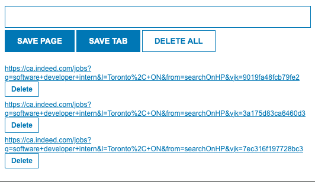

# JobBoard-Butler

## Description
Job Tracker is a Chrome extension designed to streamline the job search process. It allows users to efficiently save, manage, and access job postings directly from their browser. With features to batch save job listings, manage them through a simple interface, and delete them individually or all at once, Job Tracker is the ultimate tool for job seekers looking to organize their search.

## Features
- **Save Job Postings**: Easily add job listings from any website with a single click.
- **Organize Listings**: Maintain a list of saved jobs for easy reference and management.
- **Delete Options**: Remove individual job listings or clear your entire list when needed.
- **User-Friendly Interface**: A simple and intuitive interface for efficient job tracking.

## Usage
- To save a job posting, simply click on the 'SAVE TAB' button while on the job listing page.
- Alternativly, you can manually input and save and url using the 'SAVE PAGE' button.
- View your saved jobs in the dropdown list.
- Doubleclick the 'DELETE ALL' button to clear your list, or use the individual delete buttons for each job posting.

## Interface

